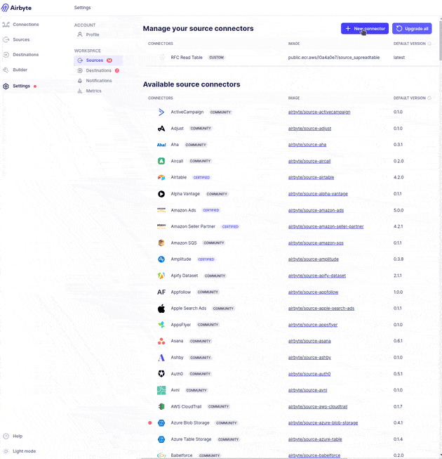
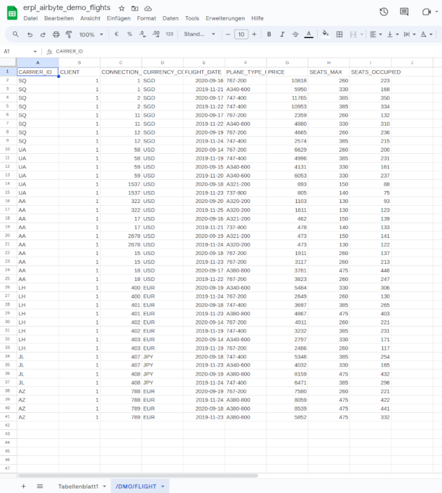

<a name="top"></a>

# Let your Airbyte talk to SAP!
Disclaimer: This source connectors are currently in an experimental state. Feel free to try it out, but be aware that minimal testing and benchmarking were done.

In this repository we use our [ERPL](https://erpl.io) and DuckDB to read data from SAP ERP, BW and other SAP ODP sources. We use the [Airbyte Python CDK](https://docs.airbyte.com/connector-development/cdk-python/) to make it easy to use the vast Airbyte ecosystem to move data out of SAP to various destinations, like BigQuery, Google Sheets, Excel, etc.

## Quicklinks

- [Let your Airbyte talk to SAP!](#let-your-airbyte-talk-to-sap)
  - [Quicklinks](#quicklinks)
  - [★ What is the ERPL Extension?](#-what-is-the-erpl-extension)
  - [⚙ Example Usage](#-example-usage)
  - [➜ Obtaining the ERPL Airbyte Connectors](#-obtaining-the-erpl-airbyte-connectors)
  - [💻 Configuring the ERPL Airbyte Connectors](#-configuring-the-erpl-airbyte-connectors)
    - [Step 1: Register the Connector](#step-1-register-the-connector)
    - [Step 2: Configure the Source](#step-2-configure-the-source)
    - [Step 3: Create a Connection](#step-3-create-a-connection)
  - [Event Tracking](#event-tracking)
    - [User Configuration Options](#user-configuration-options)
  - [License](#license)
    - [Allowed:](#allowed)
    - [Not Allowed:](#not-allowed)
    - [Additional Points:](#additional-points)

---

## ★ What is the ERPL Extension?
The primary objective of the ERPL Extensions is to facilitate seamless integration with the SAP data ecosystem. We thereby rely on the power of [DuckDB](https://duckdb.org), a very flexible database system. Our approach prioritizes:
- **Minimal dependencies**: Ensuring a lightweight experience.
- **User-centric design**: Intuitive and straightforward usage for DuckDB users.

We focus predominantly on two main use cases:
- **Data Science & Analytics**: Directly accessing data from SAP ERP (via RFC) and SAP BW (via BICS) for interactive analytical tasks.
- **Data Replication**: Efficiently migrating data from SAP ERP or SAP BW into DuckDB for incorporation into DuckDB-centric data workflows.

Please be aware that DataZoo GmbH is the independent developer of this extension and does not hold any affiliation with DuckDB Labs or the DuckDB Foundation. "DuckDB" is a trademark registered by the DuckDB Foundation.

Our development journey is underway, with a functioning prototype available that facilitates:
- Data queries from SAP ERP tables.
- Execution of RFC functions.

Transparency is our ethos, and in line with this, we are planning a commercial trajectory for the extension, structured as follows:
- **Community Edition**: A gratis version for individual users, both private and commercial, enabling queries from SAP ERP tables.
- **Commercial License**: Designed for businesses developing services or products leveraging our extension. More details can be found in [our BSL v1. License](./LICENSE.md).
- **Enterprise Edition**: A premium version offering additional capabilities to query data from SAP Business Warehouse and data replication via SAP ODP.

For inquiries, potential collaborations, or if your curiosity is piqued, connect with us at [https://erpl.io](https://erpl.io).

[Back to Top](#top)

## ⚙ Example Usage
To get a first impression of how easy it is to use the ERPL Airbyte connectors, we will show you how to read data from a SAP ERP table into Google Sheets. For this we use the [Airbyte Google Sheets Destination](https://airbyte.com/connectors/googlesheets) and the [ERPL Airbyte SAP Read Table Source](./source-sapreadtable/).

The following short video gives you an overview of the configuration steps:



As a result of our efforts you get the data of the SAP ERP table `/DMO/FLIGHT` in Google Sheets:



Within 3 minutes we brought the data from SAP ERP to Google Sheets. Cool, right?
If you want to try it out yourself, follow the steps below. If you are more interested in technical details and a first free 30min heads-up session, feel free to reach out to us via [our contact form](https://erpl.io/contact.html).

[Back to Top](#top)

## ➜ Obtaining the ERPL Airbyte Connectors
Airbyte distributes it's connectors via Docker images. Each connector is a separate image. Our images are not yet available on the official Airbyte Docker Hub. However we provide our images on our own [public docker registry](https://gallery.ecr.aws/l0a4a0e7). Currently we have the following images available:

Component | Code | Description | Gallery Link
:--- | :--- | :--- | :---
**SAP Read Table** | [`source-sapreadtable`](./source-sapreadtable/) | Reads data from SAP ERP via the ERPL [RCF Read Table](https://erpl.io/docs/key_tasks/erp_table.html) functionality | [Link](https://gallery.ecr.aws/l0a4a0e7/erpl-airbyte-sap-erp-source)
**SAP BW Cube** | [`source-sapbics`](./source-sapreadtable/) | Reads data from SAP BW sources via the ERPL [BICS interface](https://erpl.io/docs/key_tasks/bw_query.html) | TODO
**SAP ODP Replication** | [`source-sapodp`](./source-sapreadtable/) | Reads data from ODP sources via the ERPL [ODP interface](https://erpl.io/docs/key_tasks/replicate_odp.html) | TODO

Keep in mind that the development of the connectors are still in an experimental state. Feel free to try them out, but be aware that minimal testing and benchmarking were done. In case you have questions don't hesitate to reach out to us (e.g. via GitHub issues or via [other contact methods](https://erpl.io/contact.html)).

[Back to Top](#top)

## 💻 Configuring the ERPL Airbyte Connectors

To use the ERPL Airbyte connectors, you need to configure them in the Airbyte UI. The following steps guide you through the configuration of the SAP Read Table connector.

- [x] Register the **connector** in the Airbyte UI.
- [x] Configure a **source** using the connector.
- [x] Creating **connection** between the SAP source and the destination.

### Step 1: Register the Connector
The uploading of a Docker based connector via the Airbyte UI is a simple process. It is described in detail in the Airbyte Documentation: [Uploading Docker-based custom connectors](https://docs.airbyte.com/operator-guides/using-custom-connectors). The guide walks through the setup of a Docker-based custom connector.

The following information is required to register the connector:
- **Name**: The name of the connector. You can freely choose the name, e.g. `ERPL SAP Read Table`.
- **Docker Repository Name**: The name of the Docker image. You can find the image name and avialable versions in the [ERPL Airbyte Docker Registry](https://gallery.ecr.aws/l0a4a0e7).
- **Docker Image Tag**: The tags/versions can also be found via the registry.

After that the image is pulled from the registry. This can take some time, depending on the connectivity your server.

### Step 2: Configure the Source
After the connector is registered, you can configure a source using the connector. The configuration of the source is done in the Airbyte UI. The following information is required to configure the source:

- **sap_ashost**: The SAP application server host. ERPL uses the RFC protocol to connect to the SAP system. Direct network connectivity has to be possible from Airbyte to the SAP system.
- **sap_sysnr**: The SAP system number. This is a 2-digit number that identifies the SAP system.
- **sap_client**: The SAP client number. This is a 3-digit number that identifies the client in the SAP system.
- **sap_user**: The SAP user that is used to connect to the SAP system.
- **sap_passwd**: The password of the SAP user.

There are a few optional parameters that can be set:
- **sap_lang**: The language that is used to connect to the SAP system. The default is `EN`.
- **table_selection**: The table that should be read from the SAP system. If you know already the name of the table, you can set this parameter to the table name. If you roughly know what your are interested in, you can set this parameter to a wildcard pattern, e.g. `VB*` to read all tables starting with `VB`.

### Step 3: Create a Connection
After the source is configured, you can create a connection between the source and the destination. The process is again described in detail in the Airbyte Documentation: [Set up a Connection](https://docs.airbyte.com/using-airbyte/getting-started/set-up-a-connection).

The process is straight forward. You select the source and the destination and set up the connection. The connection is then scheduled and the data is transferred from the source to the destination. You also see how this is done in the [Example Usage](#-example-usage) section above.

[Back to Top](#top)


## Event Tracking
Data is transmitted under these circumstances:
- **Extension Load**: No extra data is sent beyond the initial usage information.
- **Function Invocation**: The name of the invoked function is sent. *Note: Function inputs/outputs are not transmitted.*
- **Error Occurrence**: The error message is transmitted.

### User Configuration Options
Users can control tracking through these settings:

1. **Enable/Disable Tracking**:
   ```sql
   SET erpl_telemetry_enabled = TRUE; -- Enabled by default; set to FALSE to disable tracking
   ```
   
2. **Posthog API Key Configuration** (usually unchanged):
   ```sql
   SET erpl_telemetry_key = 'phc_XXX'; -- Pre-set to our key; customizable to your own key
   ```

This approach ensures transparency about data collection while offering users control over their privacy settings.

[Back to Top](#top)

## License
The ERPL extension is licensed under the [Business Source License (BSL) Version 1.1](./LICENSE.md). The BSL is a source-available license that gives you the following permissions:

### Allowed:
1. **Copy, Modify, and Create Derivative Works**: You have the right to copy the software, modify it, and create derivative works based on it.
2. **Redistribute and Non-Production Use**: Redistribution and non-production use of the software is permitted.
3. **Limited Production Use**: You can make production use of the software, but with limitations. Specifically, the software cannot be offered to third parties on a hosted or embedded basis.
4. **Change License Rights**: After the Change Date (five years from the first publication of the Licensed Work), you gain rights under the terms of the Change License (MPL 2.0). This implies broader permissions after this date.

### Not Allowed:
1. **Offering to Third Parties on Hosted/Embedded Basis**: The Additional Use Grant restricts using the software in a manner that it is offered to third parties on a hosted or embedded basis.
2. **Violation of Current License Requirements**: If your use does not comply with the requirements of the BSL, you must either purchase a commercial license or refrain from using the software.
3. **Trademark Usage**: You don't have rights to any trademark or logo of Licensor or its affiliates, except as expressly required by the License.

### Additional Points:
- **Separate Application for Each Version**: The license applies individually to each version of the Licensed Work. The Change Date may vary for each version.
- **Display of License**: You must conspicuously display this License on each original or modified copy of the Licensed Work.
- **Third-Party Receipt**: If you receive the Licensed Work from a third party, the terms and conditions of this License still apply.
- **Automatic Termination on Violation**: Any use of the Licensed Work in violation of this License automatically terminates your rights under this License for all versions of the Licensed Work.
- **Disclaimer of Warranties**: The Licensed Work is provided "as is" without any warranties, including but not limited to the warranties of merchantability, fitness for a particular purpose, non-infringement, and title.

This summary is based on the provided license text and should be used as a guideline. For legal advice or clarification on specific points, consulting a legal professional is recommended, especially for commercial or complex use cases.

[Back to Top](#top)