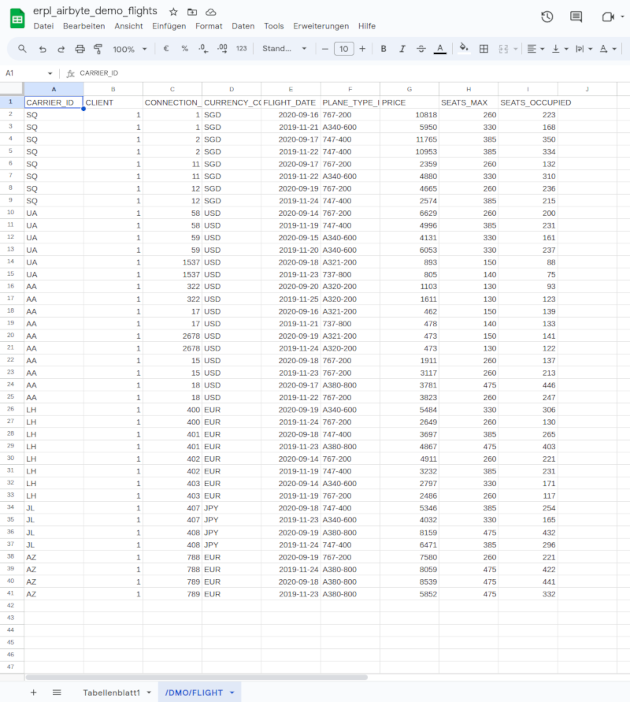

<p align="center">
  
</p>

# source-sap — replicate SAP with Airbyte

An Airbyte source that reads SAP through the [ERPL](https://erpl.io) DuckDB
extensions. One connector, five ways into the system:

| You want | Protocol | What it reads |
|---|---|---|
| A table or CDS view | **RFC** | Any transparent, pool or cluster table, with columns and filters pushed into SAP |
| The result of a BAPI or function module | **RFC function modules** | Any remote-enabled module, called with your parameters |
| A BW query or cube | **BICS** | InfoProviders and BEx queries, including variable binding |
| Changes, not snapshots | **ODP (RFC)** | BW, ABAP_CDS, SAPI, SLT and HANA providers — full and delta |
| Changes, over the Gateway | **ODP (OData)** | The same, over HTTP, where RFC is not available |

Both ODP protocols sync incrementally through SAP's own delta mechanism and emit
deletes as Airbyte CDC tombstones, where the provider reports deletes at all —
see [incremental](docs/incremental.md).

## Install

The connector runs as a Docker image, `linux/amd64` only — ERPL publishes no
arm64 build.

In Airbyte: **Settings → Sources → Add a new connector**

```
Docker repository:  datazoo/source-sap
Docker image tag:   1.0.0
```

Everything below can also be driven from the command line, which is what the
examples show. Building the image yourself, or running from a checkout, is in
[development](docs/development.md).

## Getting started

Five steps. The second is where SAP systems differ from each other.

### 1. See it run — no SAP needed

```bash
docker run --rm datazoo/source-sap:1.0.0 spec
```

Prints the connector's configuration schema. If that works, the image is sound
and everything from here is about SAP.

### 2. Get what you need from Basis

Three things, and the second is the one people underestimate:

| | |
|---|---|
| **Logon** | `ashost` + `sysnr` (or `mshost` + `sysid` + `group`), `client`, `user`, `password` |
| **Authorizations** | `S_RFC` for the function groups your protocol calls — hand them [authorizations.md](docs/authorizations.md) |
| **What to read** | a table name, a function module, a BW query, or an ODP provider |

For **ODP over OData** you also need the Gateway base URL and an activated
service. Behind a SAProuter, add the route string *and* the router's hostname.

### 3. Write a config and check the connection

```json
{
  "ashost": "sap.example.com", "sysnr": "00", "client": "100",
  "user": "AIRBYTE", "password": "…", "lang": "EN",
  "protocol": { "mode": "rfc", "table_pattern": "SFLIGHT" }
}
```

Save it as `config.json`. In the Airbyte UI the same fields are a form; from the
command line:

```bash
docker run --rm --network host \
    -v "$PWD/config.json:/config.json:ro" \
    datazoo/source-sap:1.0.0 check --config /config.json
```

`--network host` works on Linux. On Docker Desktop (macOS, Windows) drop it and
use `host.docker.internal` as the `ashost` instead.

A failure here is almost always the host, the client, or a missing `S_RFC`
authorization — the message says which, and
[troubleshooting](docs/troubleshooting.md) covers the rest.

### 4. Get your first table out

Refresh the schema, select the `SFLIGHT` stream, run the sync.

Then make it fast: naming the columns you actually want is worth **3.8x** on a
wide table ([performance](docs/performance.md)).

```json
{ "protocol": { "mode": "rfc", "objects": [
    { "name": "SFLIGHT", "columns": ["CARRID", "CONNID", "FLDATE", "PRICE"] }
] } }
```

### 5. Keep it in sync

Full refresh is the default. For genuine change data — including deletes — use
ODP: the first incremental run returns a snapshot and registers a subscription
on SAP, and later runs return only what changed.

Read [incremental sync](docs/incremental.md) before you delete a connection: the
subscription lives on SAP, and removing the connection without resetting the
stream leaves it behind.

## Docs

**Getting it working**

- [`docs/authorizations.md`](docs/authorizations.md) — **what your Basis team will ask**: the exact function modules per protocol, the RFC user, SNC
- [`docs/glossary.md`](docs/glossary.md) — the SAP words, if you do not use them daily
- [`docs/troubleshooting.md`](docs/troubleshooting.md) — the errors you will actually see, and what each one means

**Reading data**

- [`docs/tables.md`](docs/tables.md) — tables and CDS views: patterns, projection, SAP-side filters
- [`docs/function-modules.md`](docs/function-modules.md) — calling BAPIs and function modules, and why discovery never calls them
- [`docs/bw-queries.md`](docs/bw-queries.md) — BW cubes and BEx queries, variables, and slicing a query that will not fit in memory

**Keeping data in sync**

- [`docs/incremental.md`](docs/incremental.md) — the three incremental mechanisms, how to choose, and **ODQ subscription hygiene**
- [`docs/operations.md`](docs/operations.md) — running it in anger: failures, resets, what a stranded subscription looks like

**How it behaves, and how fast**

- [`docs/performance.md`](docs/performance.md) — measured numbers, dated, with the tool that produced each one
- [`docs/reference.md`](docs/reference.md) — every configuration field, in one place

**Working on the connector**

- [`docs/development.md`](docs/development.md) — building, testing against a real SAP system, the no-mock policy
- [`docs/registry-submission.md`](docs/registry-submission.md) — the Airbyte registry position, and why the licence check fails
- [`docs/review-decisions.md`](docs/review-decisions.md) — review findings deliberately not acted on, with reasons

[`docs/integrations/sources/sap.md`](docs/integrations/sources/sap.md) is the
page Airbyte itself renders inside the product. It covers the same ground as
this index, in the shape the registry requires.

## Licence

Business Source License 1.1 — see [LICENSE](./LICENSE), the same licence as the
ERPL extensions this connector embeds. You may use it in production, but not
offer it to third parties on a hosted or embedded basis; the licence converts to
MPL 2.0 five years after publication. BICS and ODP replication are ERPL
Enterprise Edition features. For commercial terms, see [erpl.io](https://erpl.io).
